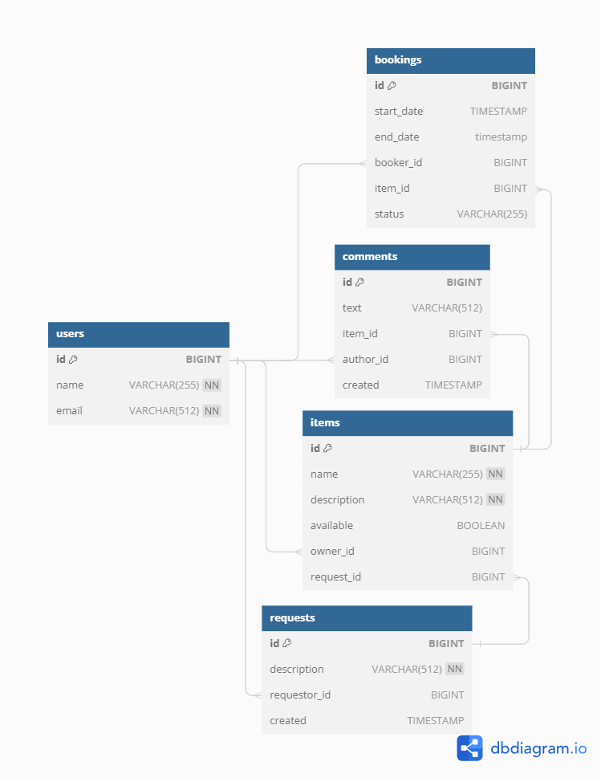

# Share it
___

Учебный проект. Сервис для поиска и аренды вещей.  
___
За основу взята микросервисная архитектура.

Сервисы:  
* gateway - валидация входных данных
* server - основной сервис, бизнес-логика


  

В функционале приложения предусмотрено хранение в базе данных информации о пользователях, вещах пользователей,
возможность создания бронирования на аренду вещи, комментариев к вещи с завершенным бронированием, а также запросов на аренду с описанием необходимой вещи. 

___
### Стек:  
* Java 11
* Spring Boot
* Maven
* JUnit
* Lombok
* JPA, Hibernate
* PostgreSQL
* Mockito
* Docker
___

### Запуск проекта  
  
Для работы приложения необходим Docker.  

#### 1. Клонировать репозиторий:  
```bash
git clone "ссылка на проект"
```
#### 2. Перейти в корневую папку проекта:  
```bash
cd java-shareit/
```
#### 3. Запустить приложение через docker-compose  
```bash
docker-compose up
```
___
### URL API при локальном запуске
**gateway** `http://localhost:8080`  
**main service** `http://localhost:9090`

[*Postman-коллекция*](https://github.com/yandex-praktikum/java-shareit/blob/add-docker/postman/sprint.json) с примерами запросов.  
___
#### Диаграмма базы данных



